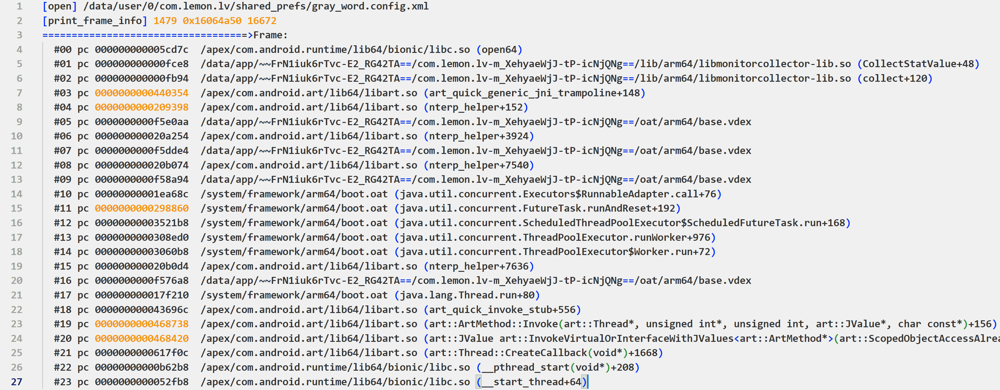

# unwinddaemon

## 编译步骤

- 同步AOSP
- 在AOSP源码文件夹下创建`system/extras/unwinddaemon`文件夹
- 将本项目的`Android.bp`和`main.cpp`放入上一步创建的文件夹
- 在AOSP源码文件夹下打开终端，执行下面的命令进行编译
    ```bash
    . build/envsetup.sh
    lunch aosp_arm64-eng
    mmma system/extras/unwinddaemon
    ```
- 编译成功后，产物在`out/target/product/generic_arm64/system/bin/unwinddaemon`

## 使用

将`out/target/product/generic_arm64/system/bin/unwinddaemon`推送到手机的`/data/local/tmp`，授予可执行权限

然后执行`/data/local/tmp/unwinddaemon`即可

`hook_open_with_stack.py`是配合bcc修改使用的demo

`bin/unwinddaemon`是预编译好的，但不一定兼容

bcc修改参见

- https://github.com/SeeFlowerX/unwindbcc/commit/f6548633e1d8afd527637f0da69959046986a25c

原理，代码修改等，请查阅[eBPF on Android之实现基于dwarf的用户态栈回溯](https://blog.seeflower.dev/archives/175/)

## 效果示意图



---

## 共享库版本

编译`lib.cpp`得到的产物如下，在[SeeFlowerX/stackplz](https://github.com/SeeFlowerX/stackplz)中使用

```bash
ld-android.so
libbase.so
libc++.so
libdl.so
liblog.so
liblzma.so
libm.so
libstackplz.so
libunwindstack.so
```